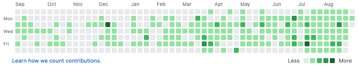
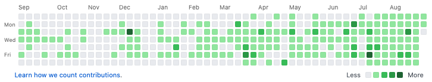

# 履歴改ざん

コミット歴の改変は原則禁止



↑これを

↓こうする



## コミットログの確認

`git log --pretty=fuller`でログの詳細が確認できる。

このコマンドで見える`AuthorDate`を任意の値に書き換えることで狙った日時でコミットしたことにできる。

```text
git log --pretty=fuller

commit a76f12a15d67c6c70e832b5598e7002ec0435f68 (HEAD -> master)
Author:     rokumura7 <rokumura@mail.com>
AuthorDate: Tue Sep 1 02:00:16 2020 +0900
Commit:     rokumura7 <rokumura@mail.com>
CommitDate: Tue Sep 1 02:00:16 2020 +0900

    added Author.java

commit e9adacf15b9d07388b62b01ccd6e4ae23eb88b25
Author:     rokumura7 <rokumura@mail.com>
AuthorDate: Tue Sep 1 01:48:08 2020 +0900
Commit:     rokumura7 <rokumura@mail.com>
CommitDate: Tue Sep 1 01:48:08 2020 +0900

    added Identifiable classes

commit a4718a4074bceff2b171af6b75db750ff9dec471
Author:     rokumura7 <rokumura@mail.com>
AuthorDate: Tue Sep 1 01:38:50 2020 +0900
Commit:     rokumura7 <rokumura@mail.com>
CommitDate: Tue Sep 1 01:38:50 2020 +0900

    moved Book.java

commit fc8e21a9d5b15eb65692f1b60ae6af9ef252c716
Author:     rokumura7 <rokumura@mail.com>
AuthorDate: Tue Sep 1 01:37:03 2020 +0900
Commit:     rokumura7 <rokumura@mail.com>
CommitDate: Tue Sep 1 01:37:03 2020 +0900

    fixed Book.java

commit 9cb08f6fdd246a34391ee49fe12fb5c6a939ebcd (origin/master, origin/HEAD)
Author:     rokumura7 <rokumura@mail.com>
AuthorDate: Thu Aug 27 20:44:42 2020 +0900
Commit:     rokumura7 <rokumura@mail.com>
CommitDate: Thu Aug 27 20:44:42 2020 +0900

    implement book builder
```

## コミットを編集モードにする

`git rebase -i`でコミットを改変していく。

この例ではHEADから4つ目までを操作する。  
デフォルトでは`pick`になっているので`edit`に変更。

```text
git rebase -i HEAD~4

edit fc8e21a fixed Book.java
edit a4718a4 moved Book.java
edit e9adacf added Identifiable classes
edit a76f12a added Author.java

# Rebase 9cb08f6..a76f12a onto a76f12a (4 commands)
```

## コミットの日付を変える

コミット時に`--date={date}`で任意の日付を指定できる。

```text
git commit --amend --date="Fri Aug 28 20:00:00 2020 +0900"
git rebase --continue

git commit --amend --date="Sat Aug 29 20:00:00 2020 +0900"
git rebase --continue
git commit --amend --date="Sun Aug 30 20:00:00 2020 +0900"
git rebase --continue
git commit --amend --date="Mon Aug 31 20:00:00 2020 +0900"
git rebase --continue
```

## コミットログの確認

```text
commit d9f1101e09608641acd53d66a4a8b33f5167c61b (HEAD -> master, origin/master, origin/HEAD)
Author:     rokumura7 <rokumura@mail.com>
AuthorDate: Mon Aug 31 20:00:00 2020 +0900
Commit:     rokumura7 <rokumura@mail.com>
CommitDate: Tue Sep 1 08:09:40 2020 +0900

    added Author.java

commit 7ae4ad9820d235a32ffe4b25ce77deeed654674d
Author:     rokumura7 <rokumura@mail.com>
AuthorDate: Sun Aug 30 20:00:00 2020 +0900
Commit:     rokumura7 <rokumura@mail.com>
CommitDate: Tue Sep 1 08:09:19 2020 +0900

    added Identifiable classes

commit 7c46f627db47e6a0a1b79e56e311d38d15a95b89
Author:     rokumura7 <rokumura@mail.com>
AuthorDate: Sat Aug 29 20:00:00 2020 +0900
Commit:     rokumura7 <rokumura@mail.com>
CommitDate: Tue Sep 1 08:08:17 2020 +0900

    moved Book.java

commit 8242681a7cc966b284fe03143119098bed5a98d9
Author:     rokumura7 <rokumura@mail.com>
AuthorDate: Fri Aug 28 20:00:00 2020 +0900
Commit:     rokumura7 <rokumura@mail.com>
CommitDate: Tue Sep 1 08:06:50 2020 +0900

    fixed Book.java

commit 9cb08f6fdd246a34391ee49fe12fb5c6a939ebcd
Author:     rokumura7 <rokumura@mail.com>
AuthorDate: Thu Aug 27 20:44:42 2020 +0900
Commit:     rokumura7 <rokumura@mail.com>
CommitDate: Thu Aug 27 20:44:42 2020 +0900

    implement book builder
```

